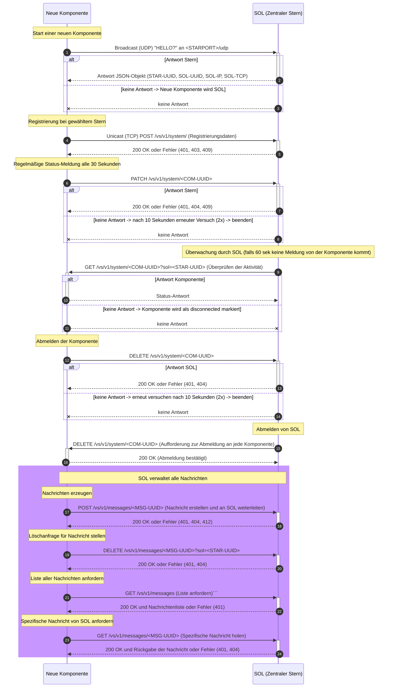

```mermaid
sequenceDiagram
    autonumber
    participant NewComponent as Neue Komponente
    participant SOL as SOL (Zentraler Stern)    
    
    Note over NewComponent: Start einer neuen Komponente
    NewComponent->>+SOL: Broadcast (UDP) "HELLO?" an <STARPORT>/udp
    alt Antwort Stern
        SOL-->>-NewComponent: Antwort JSON-Objekt (STAR-UUID, SOL-UUID, SOL-IP, SOL-TCP)
    else keine Antwort -> Neue Komponente wird SOL
        SOL--xNewComponent: keine Antwort
    end

    Note over NewComponent: Registrierung bei gewähltem Stern
    NewComponent->>+SOL: Unicast (TCP) POST /vs/v1/system/ (Registrierungsdaten)
    SOL-->>-NewComponent: 200 OK oder Fehler (401, 403, 409)

    Note over NewComponent: Regelmäßige Status-Meldung alle 30 Sekunden
    NewComponent->>+SOL: PATCH /vs/v1/system/<COM-UUID>
    alt Antwort Stern
        SOL-->>-NewComponent: 200 OK oder Fehler (401, 404, 409)
    else keine Antwort -> nach 10 Sekunden erneuter Versuch (2x) -> beenden
        SOL--xNewComponent: keine Antwort
    end

    Note over SOL: Überwachung durch SOL (falls 60 sek keine Meldung von der Komponente kommt)
    SOL->>+NewComponent: GET /vs/v1/system/<COM-UUID>?sol=<STAR-UUID> (Überprüfen der Aktivität)
    alt Antwort Komponente
        NewComponent-->>-SOL: Status-Antwort
    else keine Antwort -> Komponente wird als disconnected markiert
        NewComponent--xSOL: keine Antwort
    end

    Note over NewComponent: Abmelden der Komponente
    NewComponent->>+SOL: DELETE /vs/v1/system/<COM-UUID>
    alt Antwort SOL
        SOL-->>-NewComponent: 200 OK oder Fehler (401, 404)
    else keine Antwort -> erneut versuchen nach 10 Sekunden (2x) -> beenden
        SOL--xNewComponent: keine Antwort
    end

    Note over SOL: Abmelden von SOL
    SOL->>+NewComponent: DELETE /vs/v1/system/<COM-UUID> (Aufforderung zur Abmeldung an jede Komponente)
    NewComponent-->>-SOL: 200 OK (Abmeldung bestätigt)

    rect rgb(200, 150, 255)

        Note over SOL,NewComponent: SOL verwaltet alle Nachrichten
        Note over NewComponent: Nachrichten erzeugen
        NewComponent->>+SOL: POST /vs/v1/messages/<MSG-UUID> (Nachricht erstellen und an SOL weiterleiten)
        SOL-->>-NewComponent: 200 OK oder Fehler (401, 404, 412)

        Note over NewComponent: Löschanfrage für Nachricht stellen
        NewComponent->>+SOL: DELETE /vs/v1/messages/<MSG-UUID>?sol=<STAR-UUID>
        SOL-->>-NewComponent: 200 OK oder Fehler (401, 404)

        Note over NewComponent: Liste aller Nachrichten anfordern
        NewComponent->>+SOL: GET /vs/v1/messages (Liste anfordern)```

        SOL-->>-NewComponent: 200 OK und Nachrichtenliste oder Fehler (401)

        Note over NewComponent: Spezifische Nachricht von SOL anfordern
        NewComponent->>+SOL: GET /vs/v1/messages/<MSG-UUID> (Spezifische Nachricht holen)
        SOL-->>-NewComponent: 200 OK und Rückgabe der Nachricht oder Fehler (401, 404)

    end
```
