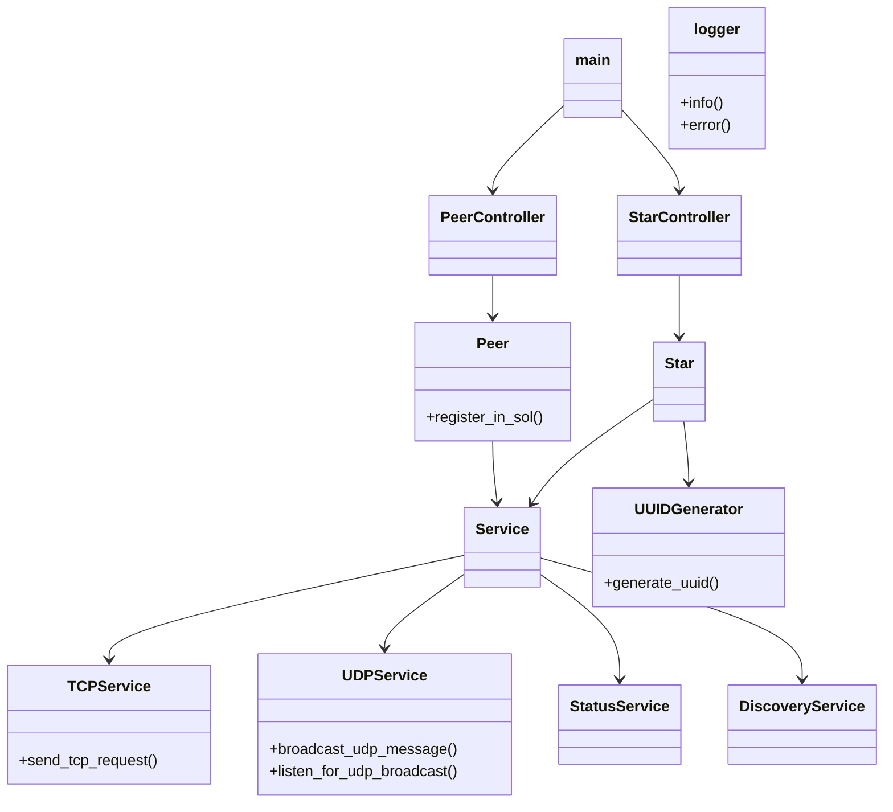

```mermaid
classDiagram
    main --> PeerController
    main --> StarController

    PeerController --> Peer

    StarController --> Star

    Peer --> Service
    Star --> Service
    Star --> UUIDGenerator

    Service --> TCPService
    Service --> UDPService
    Service --> StatusService
    Service --> DiscoveryService


    class PeerController{

    }

    class StarController{

    }

    class Peer{
        +register_in_sol()
    }

    class Star{

    }

    class Service{

    }

    class TCPService{
        +send_tcp_request()
    }

    class UDPService{
        +broadcast_udp_message()
        +listen_for_udp_broadcast()
    }

    class DiscoveryService{

    }

    class StatusService{

    }

    class logger{
        +info()
        +error()
    }

    class UUIDGenerator{
        +generate_uuid()
    }

    class main{

    }
```